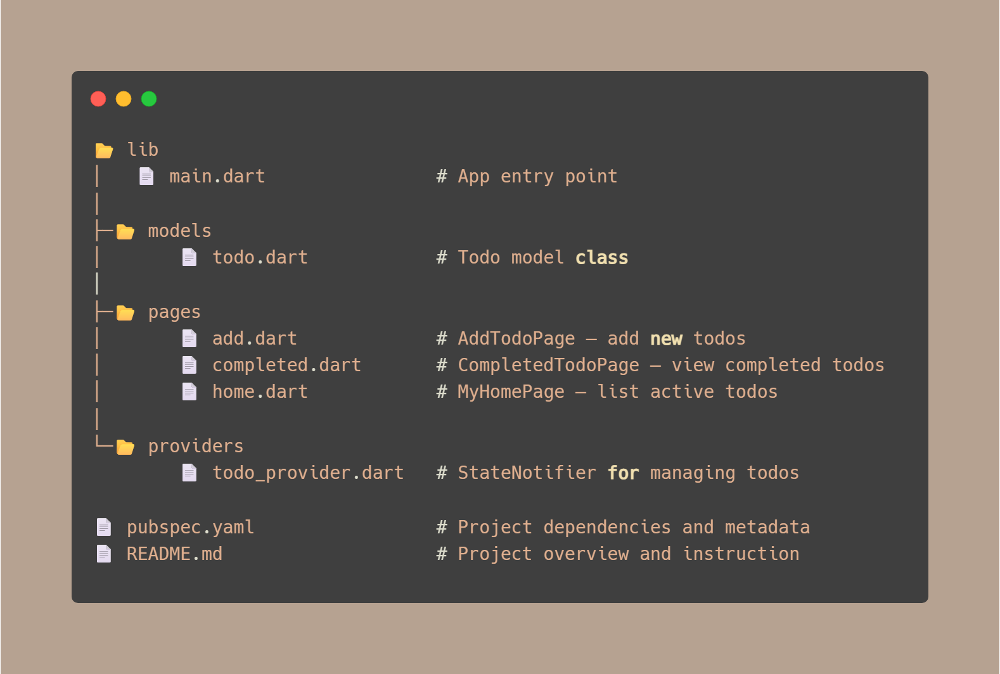

# ✅ Flutter Todo App

My **first Flutter project** 🎉 – a simple and elegant **Todo Application** built with **Flutter**, **Riverpod (state management)**, and **Slidable (for swipe actions)**.

This app allows users to **add, complete, and delete todos** with a clean UI.  
It helped me learn **state management, navigation, and UI design in Flutter**.

---

## ✨ Features

- ➕ Add new todos
- ✅ Mark todos as completed
- 🗑️ Delete active or completed todos (with swipe actions)
- 📂 View completed todos separately
- 🎨 Clean and minimal Material Design

---

## 🛠️ Tech Stack

- **Framework:** Flutter
- **State Management:** Riverpod
- **UI Enhancements:** Flutter Slidable
- **Language:** Dart

---

## 📂 Project Structure



---

## 🚀 Getting Started

### Prerequisites

- Install [Flutter](https://docs.flutter.dev/get-started/install)
- Set up a device/emulator

### Installation

```bash
# Clone the repository
git clone https://github.com/YOUR-USERNAME/to_do_app.git

# Navigate to the project folder
cd to_do_app

# Install dependencies
flutter pub get

# Run the app
flutter run

```

## 📸 Project Overview


## 📚 What I Learned

While building this project, I learned:

- How to use Riverpod for state management
- How to create and navigate between multiple screens
- How to build reusable UI components in Flutter
- How to implement swipe actions using Slidable

## 🤝 Contributing

This is my first Flutter project, but I’d love feedback and suggestions!
Feel free to open an issue or submit a PR.

## 📜 License

This project is licensed under the MIT License – see the LICENSE
file for details.
